# Semi-Supervised Cross-Domain Imitation Learning

<p align="center">
  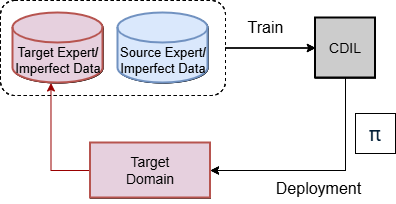
</p>

**Semi-Supervised Cross-Domain Imitation Learning**

Li-Min Chu, Kai-Siang Ma, Ming-Hong Chen, and Ping-Chun Hsieh

*Transactions on Machine Learning Research (TMLR), February 2026*

[[Paper]](https://openreview.net/forum?id=WARXnbJawZ)

## Abstract

Cross-domain imitation learning (CDIL) accelerates policy learning by transferring expert knowledge across domains, which is valuable in applications where collection of expert data is costly. Existing methods are either *supervised*, relying on proxy tasks and explicit alignment, or *unsupervised*, aligning distributions without paired data but often unstable. We introduce the **Semi-Supervised CDIL (SS-CDIL)** setting and propose **AdaptDICE**, the first algorithm for SS-CDIL with theoretical justification. Our method uses only offline data, including a small number of target expert demonstrations and some unlabeled imperfect trajectories. To handle domain discrepancy, we propose a novel cross-domain loss function for learning inter-domain state-action mappings and design an adaptive weight function to balance the source and target knowledge.

## Environments

We evaluate on **6 cross-domain transfer tasks** spanning MuJoCo locomotion and Robosuite manipulation:

### MuJoCo Locomotion (Morphology Transfer)

| Task | Source Domain | Target Domain |
|------|---------------|---------------|
| **Hopper** | Standard Hopper | Three-Thigh Hopper |
| **Ant** | 4-Legged Ant | 5-Legged Ant |
| **HalfCheetah** | Standard Cheetah | Three-Leg Cheetah |

<table align="center">
  <tr>
    <td align="center">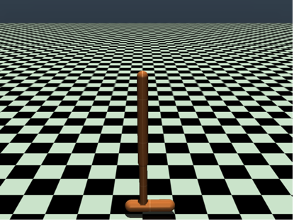<br><sub>Hopper (Source)</sub></td>
    <td align="center">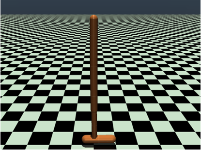<br><sub>Hopper (Target)</sub></td>
    <td width="40"></td>
    <td align="center">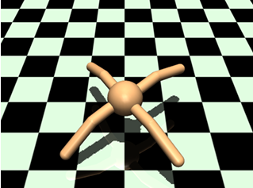<br><sub>Ant (Source)</sub></td>
    <td align="center">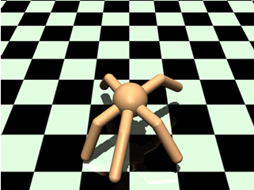<br><sub>Ant (Target)</sub></td>
  </tr>
</table>

### Robosuite Manipulation (Robot Transfer)

| Task | Source Domain | Target Domain |
|------|---------------|---------------|
| **BlockLifting** | Panda Robot | UR5e Robot |
| **DoorOpening** | Panda Robot | UR5e Robot |
| **TableWiping** | Panda Robot | UR5e Robot |

<table align="center">
  <tr>
    <td align="center">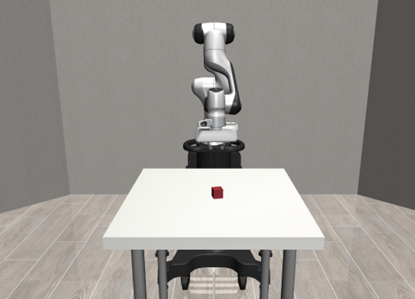<br><sub>Lift (Panda)</sub></td>
    <td align="center">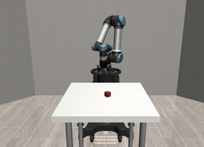<br><sub>Lift (UR5e)</sub></td>
    <td width="40"></td>
    <td align="center">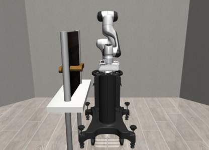<br><sub>Door (Panda)</sub></td>
    <td align="center">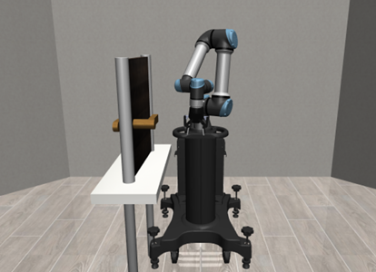<br><sub>Door (UR5e)</sub></td>
  </tr>
</table>

## Main Results

AdaptDICE consistently outperforms baselines (SMODICE, GWIL, IGDF+IQ-Learn) across all environments:

<table align="center">
  <tr>
    <td align="center">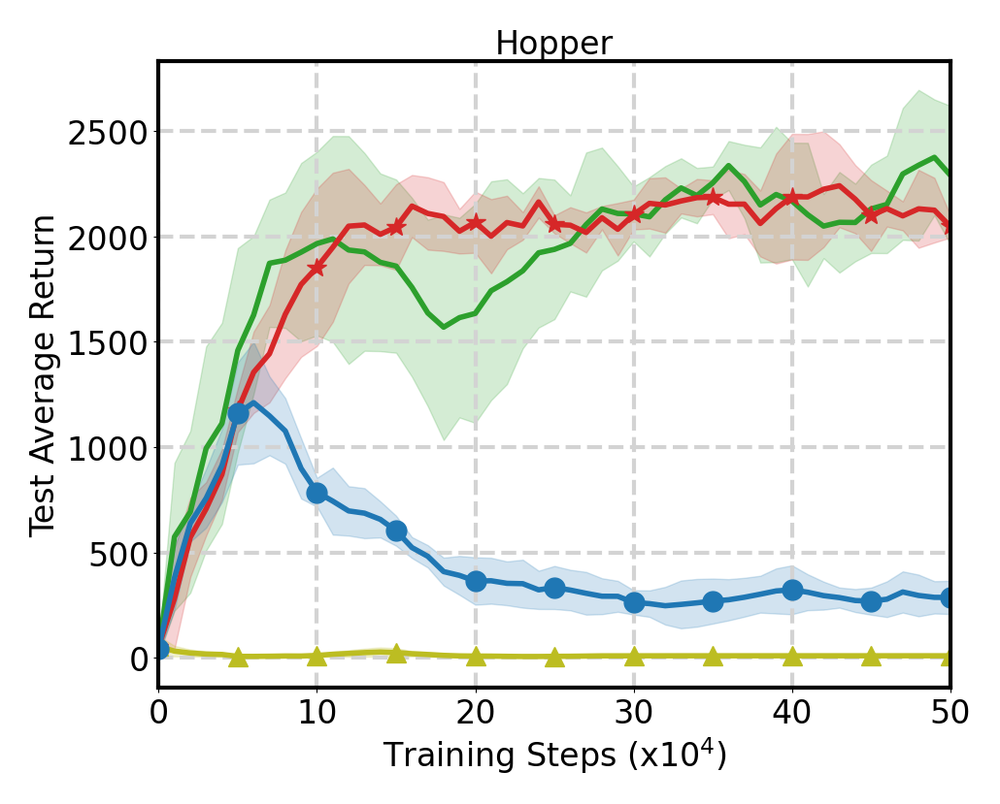<br><sub>Hopper</sub></td>
    <td align="center">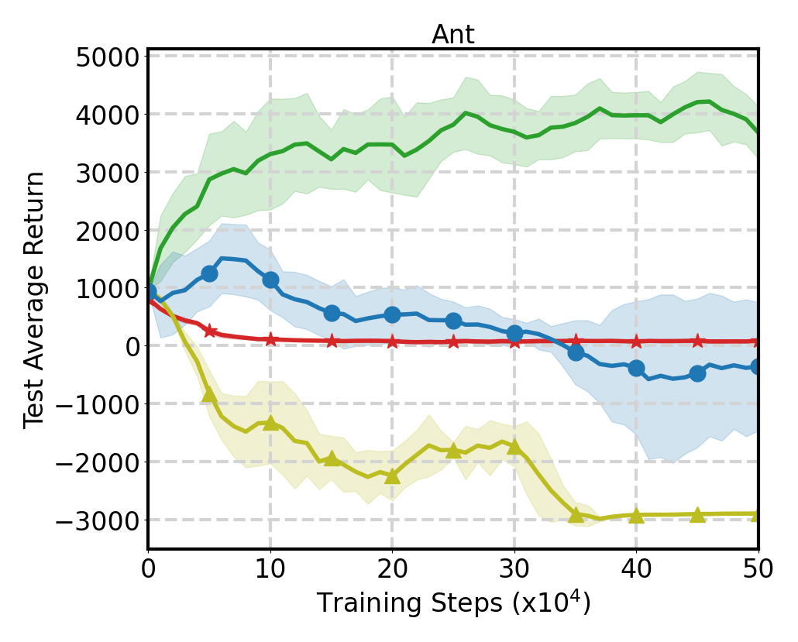<br><sub>Ant</sub></td>
    <td align="center">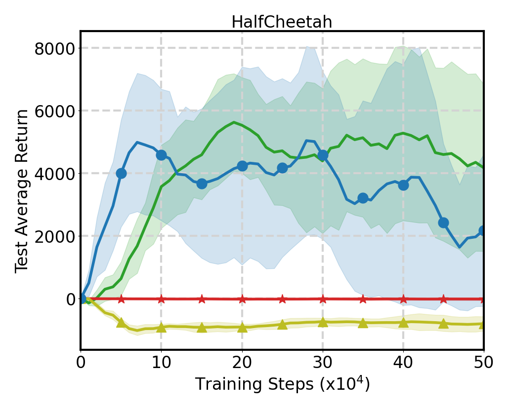<br><sub>HalfCheetah</sub></td>
  </tr>
  <tr>
    <td align="center">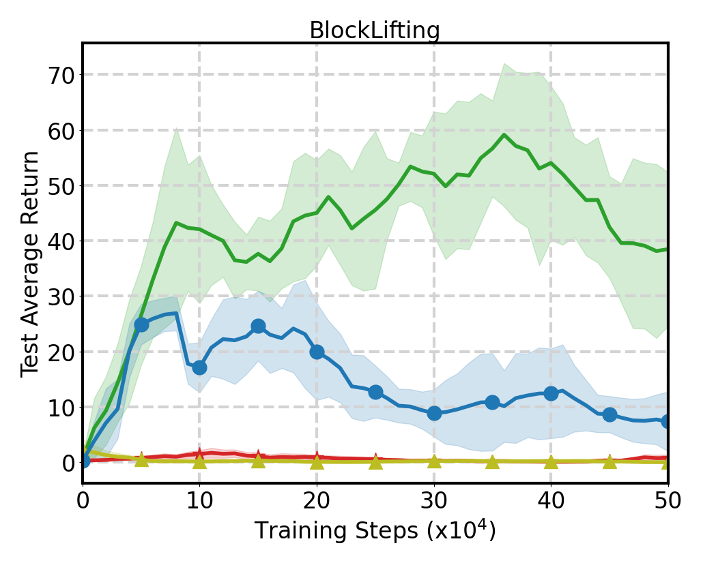<br><sub>Lift</sub></td>
    <td align="center">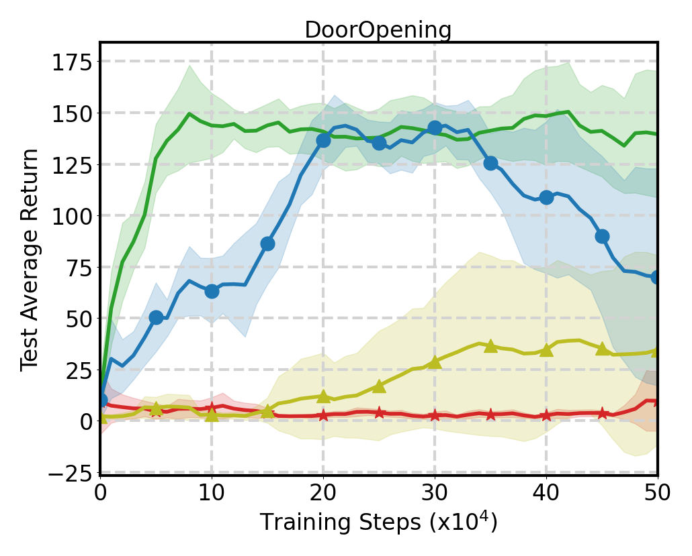<br><sub>Door</sub></td>
    <td align="center">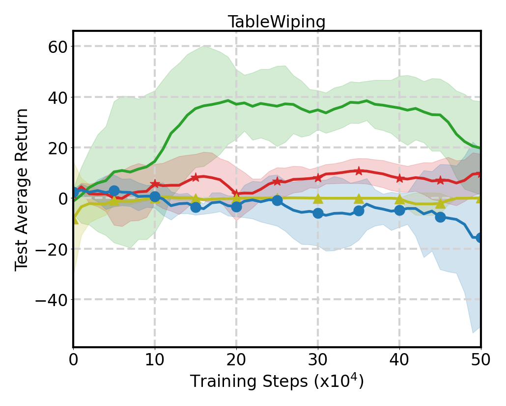<br><sub>Wipe</sub></td>
  </tr>
  <tr>
    <td colspan="3" align="center">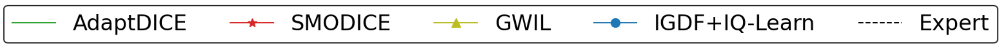<br><sub>Training curves on MuJoCo (top) and Robosuite (bottom). AdaptDICE (green) achieves the highest returns.</sub></td>
  </tr>
</table>

## Ablation Study

Comparing AdaptDICE against Target-Only (w_tar) and Source-Only (w_src) variants:

<table align="center">
  <tr>
    <td align="center">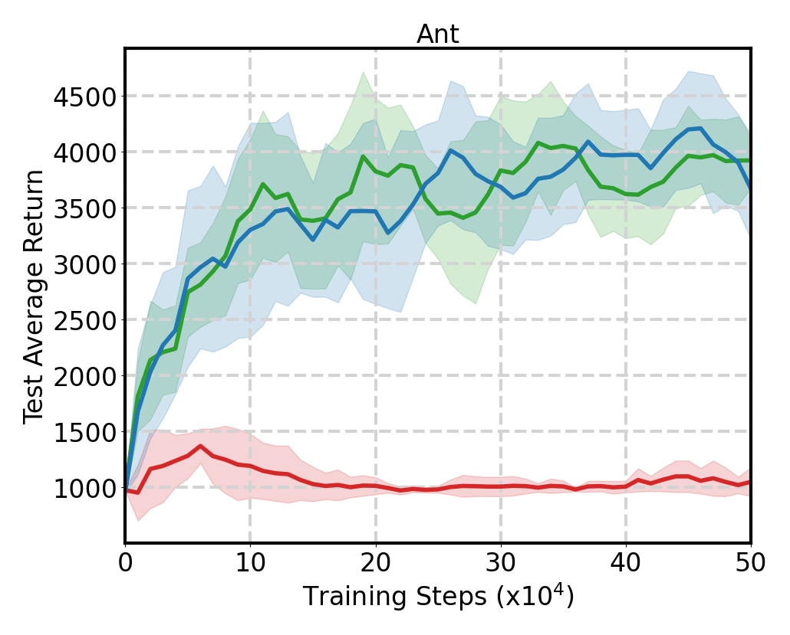<br><sub>Ant</sub></td>
    <td align="center">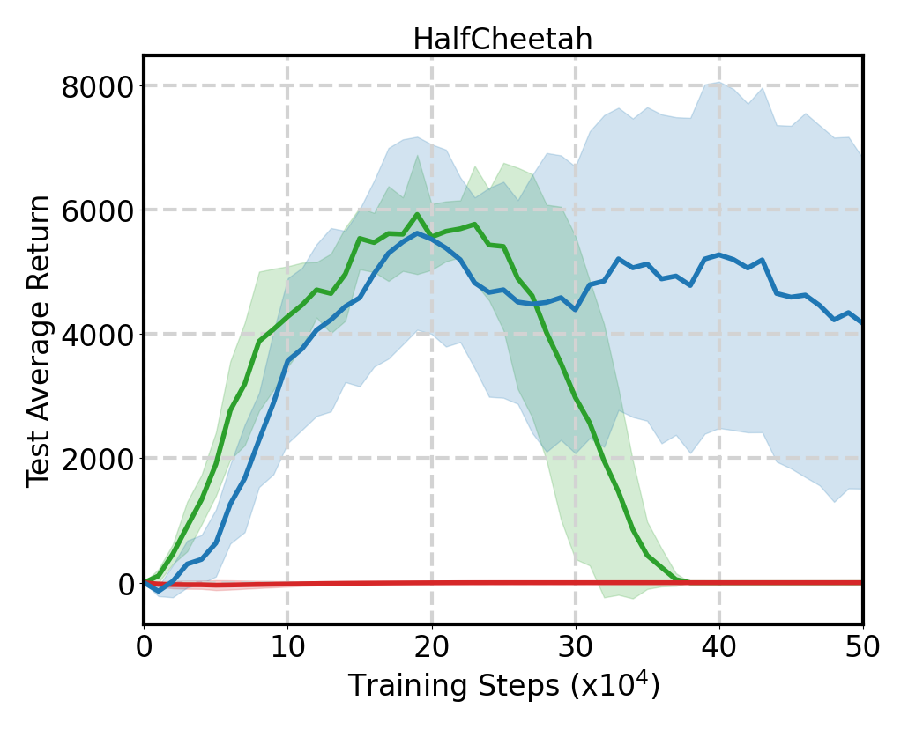<br><sub>HalfCheetah</sub></td>
    <td align="center">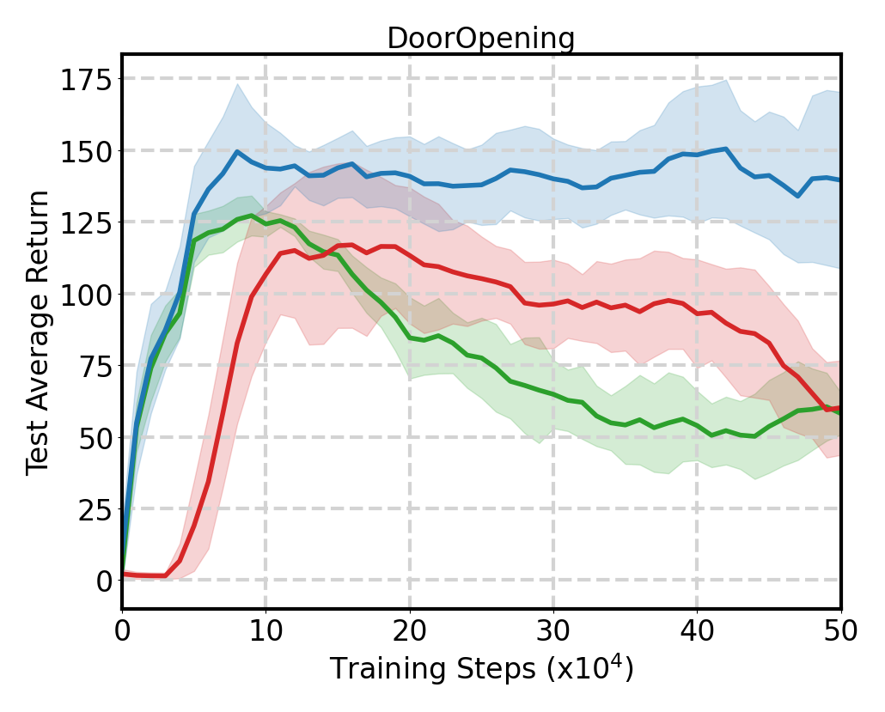<br><sub>Door</sub></td>
  </tr>
  <tr>
    <td colspan="3" align="center">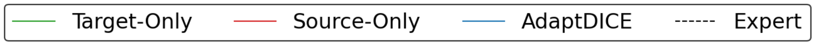<br><sub>AdaptDICE (blue) leverages both source and target knowledge, outperforming single-domain variants.</sub></td>
  </tr>
</table>

## Code Structure

```
CDIL/
├── train_il.py              # Main training entry point
├── train_il_offdynamics.py  # Training for off-dynamics experiments
├── test_model.py            # Model evaluation
├── agent/                   # Algorithm implementations
│   ├── avatar_dice.py       # AdaptDICE (our method)
│   ├── demodice.py          # DemoDICE baseline
│   ├── smodice.py           # SMODICE baseline
│   ├── gwil.py              # GWIL baseline
│   └── igdf.py              # IGDF+IQ-Learn baseline
├── env/                     # MuJoCo XML assets for target domains
├── flow_model/              # Pre-trained flow models
├── pretrained_models/       # Pre-trained DemoDICE models (source domain)
├── scripts/                 # Experiment scripts
│   ├── exp1.sh              # AdaptDICE main evaluation
│   ├── exp2.sh              # SMODICE baseline
│   ├── exp3.sh              # GWIL baseline
│   ├── exp4.sh              # IGDF+IQ-Learn baseline
│   ├── exp5.sh              # Ablation: w_tar only
│   ├── exp6.sh              # Dataset sensitivity
│   ├── exp7.sh              # Baseline data-rich
│   ├── exp8.sh              # Off-dynamics experiments
│   ├── exp9.sh              # Psi sensitivity
│   ├── exp10.sh             # Fixed vs adaptive beta
│   ├── exp11.sh             # Source data scaling
│   └── exp12.sh             # Single source expert
├── utils/                   # Utility functions
└── wrappers/                # Environment wrappers
```

## Requirements

- **Python**: 3.10.19
- **OS**: Ubuntu 24.04
- **PyTorch**: 2.9.1
- **MuJoCo**: Required for locomotion tasks
- **Robosuite**: Required for manipulation tasks

Install dependencies:

```bash
pip install -r requirements.txt
```

## Basic Usage

### Training

```bash
python train_il.py \
  --env_is_gym=0 \
  --algorithm=avatar_dice \
  --env_id=Hopper \
  --xml_path=./env/hopper_target.xml \
  --dataset_file_names="['target_hopper_5_3091.0554050953983_1000.0.npz', 'target_hopper_400_3075.603734081881_997.5925.npz', 'target_Hopper-v3_random_50.npz']" \
  --load_hdf5_dataset=0 \
  --pretrained_model_path=./pretrained_models/hopper.pickle \
  --flow_model_path=./flow_model/hopper/model/hopper_flow_seed1.pt \
  --flow_model_action_path=./flow_model/hopper/model_action/hopper_flow_seed1.pt \
  --expert_num_traj 1 \
  --seed 0
```

**Key Arguments:**
- `algorithm`: Method to use (`avatar_dice`, `demodice`, `smodice`, `gwil`, `igdf`)
- `env_id`: Environment (`Hopper`, `Ant`, `HalfCheetah`, `Lift`, `Door`, `Wipe`)
- `xml_path`: Path to target domain MuJoCo XML
- `dataset_file_names`: List of dataset files (expert, sub-optimal, random)
- `expert_num_traj`: Number of expert trajectories to use
- `pretrained_model_path`: Pre-trained source domain model
- `flow_model_path`: Flow model for state mapping

## Running Paper Experiments

We provide scripts to reproduce all experiments from the paper:

### Main Evaluation (Table 1, Figure D.1)

```bash
# AdaptDICE (our method)
./scripts/exp1.sh --seed 0

# Baselines
./scripts/exp2.sh --seed 0  # SMODICE
./scripts/exp3.sh --seed 0  # GWIL
./scripts/exp4.sh --seed 0  # IGDF+IQ-Learn
```

### Ablation Study (Table 2, Figure D.2)

```bash
# w_tar only (DemoDICE)
./scripts/exp5.sh --seed 0
```

### Dataset Sensitivity (Table 3, Figure D.3)

```bash
# Expert-Rich setting (5 expert trajectories)
./scripts/exp6.sh --seed 0 --mode expert_rich

# Sub-Optimal Rich setting (5x sub-optimal data)
./scripts/exp6.sh --seed 0 --mode suboptimal_rich
```

### Additional Experiments

```bash
# Baseline Data-Rich (Tables D.1-D.2)
./scripts/exp7.sh --seed 0 --algo smodice

# Off-Dynamics (Figure D.12)
./scripts/exp8.sh --seed 0

# Psi Sensitivity (Figure D.14)
./scripts/exp9.sh --seed 0

# Fixed vs Adaptive Beta (Figure D.13)
./scripts/exp10.sh --seed 0

# Source Data Scaling (Figure D.11)
./scripts/exp11.sh --seed 0

# Single Source Expert (Figure D.10)
./scripts/exp12.sh --seed 0
```

All scripts use tmux for parallel execution across environments. Results are logged to TensorBoard under `tfboard/`.

## Citation

If you find this work useful, please cite:

```bibtex
@article{
  chu2026semisupervised,
  title={Semi-Supervised Cross-Domain Imitation Learning},
  author={Li-Min Chu and Kai-Siang Ma and Ming-Hong Chen and Ping-Chun Hsieh},
  journal={Transactions on Machine Learning Research},
  year={2026},
  url={https://openreview.net/forum?id=WARXnbJawZ}
}
```

## License

This project is licensed under the MIT License - see the [LICENSE](LICENSE) file for details.
